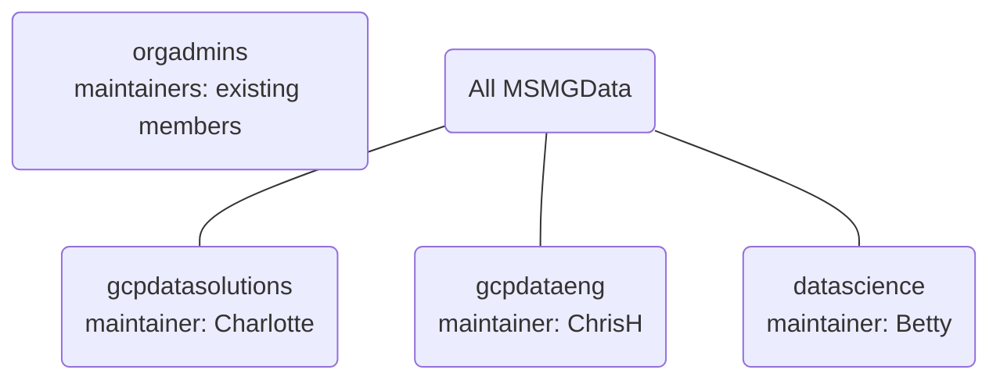

# MSMG Data team contribution guide

Documented below are guidelines that should be followed when contributing code to this project. We expect this contribution guide to evolve over time
so please keep up to date with its changes.

## PR guidelines
Pull requests (PRs) are the means by which code gets added to the main branch of this repository and only code in the main branch will be deployed to
production. The importance of PRs therefore cannot be understated and it is incumbent upon a person submitting a PR to ensure that it meets an
accepted level of quality before it can be merged.

A high-quality PR should exhibit the following:

### Refer to a Jira ticket

We use Jira to track work at [https://jira1-eu1.moneysupermarketgroup.com/projects/DATA/summary](https://jira1-eu1.moneysupermarketgroup.com/projects/DATA/summary).
The PR title and each commit message in the PR should begin with a Jira ticket reference.

Often someone may want to make a small quality-of-life improvement that isn't directly related to a currently active
Jira ticket. In such cases simply refer to non-existent ticket **DATA-0**. Please use this frugally, there shouldn't be too many
changes that aren't covered by a jira ticket.

### Tests

Functionality being introduced by a PR should be demonstrable via a test, be that a unit test or an integration test. In all cases such tests
should be being run in a CI pipeline.

### Good commit messages
What consititutes a good commit message? This article:

* [How to Write a Git Commit Message](https://chris.beams.io/posts/git-commit/)

should be considered required reading. Note there the seven rules of a great git commit message:

1. Subject to start with the JIRA ticket number i.e. DSCIE-1234
1. Separate subject from body with a blank line
1. Limit the subject line to 50 characters
1. Capitalize the subject line
1. Do not end the subject line with a period
1. Use the imperative mood in the subject line
1. Wrap the body at 72 characters
1. Use the body to explain what and why vs. how

To prevent GitHub workflows triggering unnecessarily and where appropriate, such as for documentation commits, include one of the following in the commit message
* [skip ci]
* [ci skip]
* [no ci]
* [skip actions]
* [actions skip]

You could make your life easier by following the advice presented at

* [Better Commit Messages with a .gitmessage Template](https://thoughtbot.com/blog/better-commit-messages-with-a-gitmessage-template)

### Keep PRs small

PRs should contain as few changes as possible, for two reasons:

1. Doing so makes them easier to review thus likelier that your PR will get merged sooner rather than later
1. It will be easier for your colleagues to merge your work into their own branch and they'll like you more for it

So keep your PRs small. If you have a subset of the code that you are working on that you consider to be complete and is ready to be
deployed to production then submit a PR for it - you don't have to submit all work required for a particular feature in one
monolithic PR.

Where PRs are unavoidably large insist that the PR author gives a walkthrough of the code and the tests. We recommend that the person
"driving" the walkthrough is the PR reviewer rather than the PR author as this will help to breed familiarity with the code in
question. No reason why walkthroughs should nt be conducted with many people, in fact this is encouraged.

### Consider squashing your commits

If you have many commits in your PR (which is a natural consequence of the development process) then consider squashing them into a
collection of smaller commits. Squashing is commonly-used term in the git community, it literally means combining many commits into
less commits. A common method of squashing commits is to use interactive rebase (`git rebase -i`) which you can read more about at

* [Git Interactive Rebase, Squash, Amend and Other Ways of Rewriting History](https://thoughtbot.com/blog/git-interactive-rebase-squash-amend-rewriting-history)

Highly recommend is video [Tutorial + Best Practice discussion. Git and GitHub workflows](https://web.microsoftstream.com/video/73b47fe7-bdae-40a9-8928-80ef0e8892aa) which is a recording of a presentation that team member Ben Marengo
gave on 2021-07-14 outlining useful strategies for using git.

### Merging

Once someone has started reviewing a PR, a rebase should be avoided where possible. This makes it easier for the reviewer to track new changes to the PR since their previous review.
Therefore avoid squashing commits after a review has started. You should instead squash while merging.

The individual opening the PR should be the one to merge the PR once it's approved and ready for merge.
You can either `enable auto-merge (squash)` or manually squash and merge.

## PR reviews

We use GitHub's [CODEOWNERS](https://docs.github.com/en/repositories/managing-your-repositorys-settings-and-features/customizing-your-repository/about-code-owners)
feature to define the teams that are allowed to approve PRs in different situations. The teams are managed at
[https://github.com/orgs/MSMGData/teams](https://github.com/orgs/MSMGData/teams).



These groups will be granted permission to approve PRs in various repositories. There is no documentation here
regarding which teams have CODEOWNER permissions in which repositories as any such documentation will eventually
be out-of-date. Consult the .CODEOWNERS file in each repository to understand permissions granted to each team.

## Pre requisites

* Read [the project README](./../README.md) to understand project layout and how to get started.


## Priority requirements

### Pre-commit

```bash
brew install pre-commit
```

This will run linters and basic checks locally saving both time and money.  If it fails locally it is likely to fail remotely.

The pre-commit tool can be run manually if the git hooks cause problems
```bash
pre-commit run
```

### Workload
We have multiple teams contributing code to this project thus we refer to each distinct area of work as a *workload* and the code that implements a
workload will reside in two terraform modules, one each in the state and runtime terraform configurations. This is documented more fully in the README:
[Source code organisation](https://github.com/MSMGData/dataplatform#source-code-organisation).

### Terraform
We use terraform as the primary means for deploying infrastructure and code hence the things you are developing need to be deployable using terraform
and if it is not please have a conversation with the project owners as to how we support doing what you're doing (e.g. we don't yet have the capability
for deploying helm charts).

### Automated testing
You are responsible for writing unit tests and integration tests to test your workload. If you can't demonstrate that the code that you're merging works
then it may not get merged.

### Secrets management
Secrets are stored in Google Secret Manager. At the time of writing only project owners can deploy secrets.

### GCP Service Accounts
You will need to create dedicated GCP service accounts for running your workload. These service accounts should be granted only the permissions
necessary for running that workload hence we request that you look to use custom roles where it makes sense to do so.

### Work in a branch
Pushing commits directly to branch main is prohibited. Please do your work in a dedicated branch and submit a PR to have it merged into main.

## General guidelines and repository hygiene

* Keep your PRs small if you want people to review them.
* Rebase from main early and often. We suggest every morning. This will help:

```bash
git stash
git pull --rebase origin main
git stash apply
```

An option you may consider is to choose to set up an alias for the above in your `.zshrc` file.

```bash
alias gpom="git stash && git pull --rebase origin main && git stash apply"

```
* Please delete your branches after they have been merged or if they have been abandoned

### Adhere to the DRY principle

The [Don't Repeat Yourself (DRY) Principle](https://en.wikipedia.org/wiki/Don%27t_repeat_yourself) states that

> Every piece of knowledge must have a single, unambiguous, authoritative representation within a system

Its easy to violate this principle so please be wary of it. For example, terraform expressions should
not appear in multiple places throughout the code, they should probably be in
[dataplatform/global-vars/global_variables.tf](../dataplatform/global-vars/global_variables.tf).
